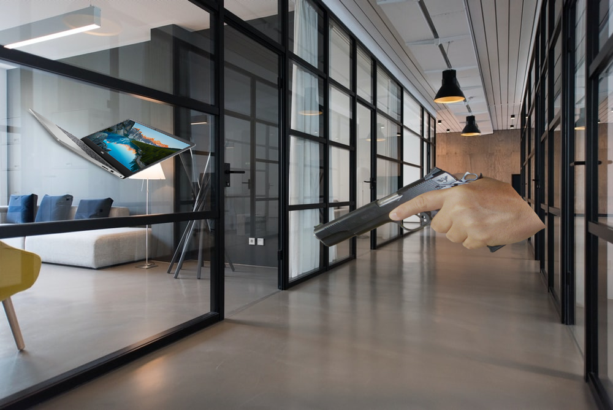

# Synthetic Dataset Creator
**Created by Sellers Industry 2020**

This project was created to help create a synthetic  dataset for the Aris Defense Weapon Detection System. This sythetic dataset creator will take images with no background and place many ontop background images. You can use either JPG or PNG for the background images. However, the object classes must be PNG, if you want them to be placed properly. You also need these images to have no background. Using object images with background have not purpose. There are a bunch of config options placed in python file, these help config how you want to create each image.

The folder structure is simple. A `backgrounds` folder which contains the backgrounds that will be used, each of these will only be used onced. There is then an `objects` directory, inside this directory you will place another folder with PNG images it in. For examples, lets say we want to add a gun class, create a folder `objects/gun` and place gun images (PNG) in that folder.

The output model in the Tensorflow format, with an `output/images` which contains all the images created and will have a `output/annotations` folder with all the xml annotations.

All these directories must be created, this means you need an `output/images`, `output/annotations`, and the other already created or the build will fail.

### Fix Code
- Very messy code, needs cleaned up
- When placing objects save position and regenerate location if it overlaps
- create own overlap calcutor and percentage of overlap, if it's less then 10%
