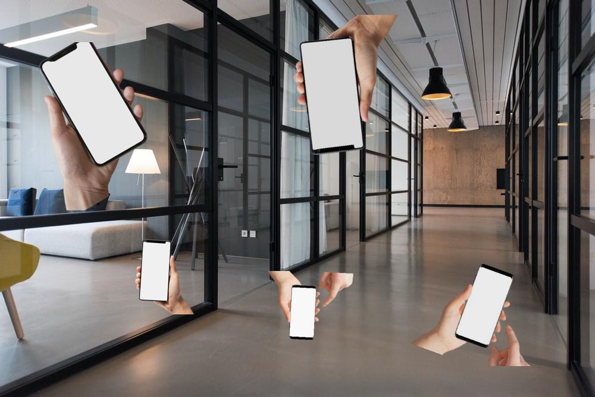
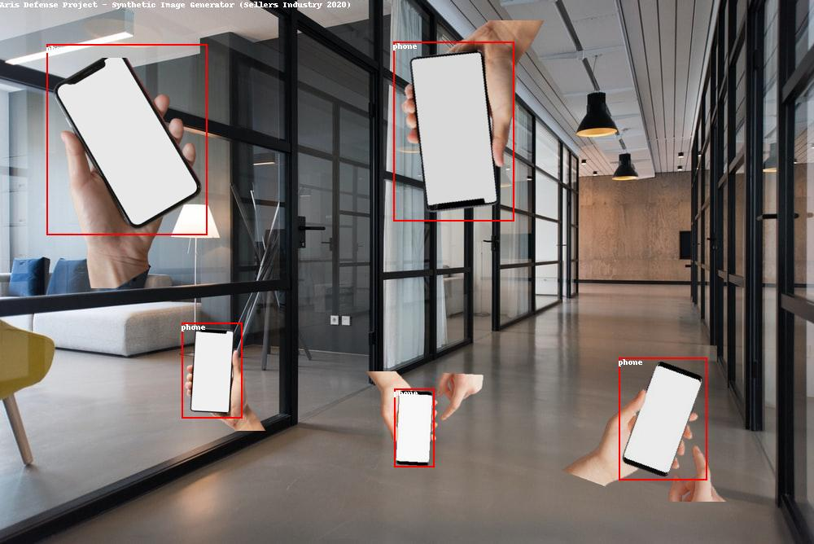

# Synthetic Dataset Creator (Aris Defense Project)
**Created by Sellers Industry 2020**

This project was created to help create a synthetic  dataset for the Aris Defense Weapon Detection System. This sythetic dataset creator will take images with no background and place many ontop background images. You can use either JPG or PNG for the background images. However, the object classes must be PNG, if you want them to be placed properly. You also need these images to have no background. Using object images with background have not purpose. There are a bunch of config options placed in python file, these help config how you want to create each image.

## Study Results
The use of synthetic generated images increases dataset accuracy and produces overall better performance in machine vision response time, accuracy, and distance. The results proved to be able 3x as effect compared to a natural dataset, when looking at distance. The dataset also produced much lower failure rates, how ever angle detection rating did decrease by a noticble difference. This could be fixed by adding a more diverse dataset to the synthetic generator.

## Description
The folder structure is simple. A `backgrounds` folder which contains the backgrounds that will be used, each of these will only be used onced. These background images can only be png. There is then an `objects` directory, inside this directory you will place another folder with PNG images it in. For examples, lets say we want to add a laptop class, create a folder `objects/laptop`, there is then a `objects/laptop/annotations` folder which you place the annotations in and an `objects/laptop/images` where laptop images (PNG) in that folder. You can use [ Make Sense AI ](makesense.ai) to create the annoations. All final images are exported as PNG to ensure support of Tensorflow.

The output model in the Tensorflow format, with an `output/images` which contains all the images created and will have a `output/annotations` folder with all the xml annotations.

All these directories must be created, this means you need an `output/images`, `output/annotations`, and the other already created or the build will fail.

Doesn't support multiple bounding per object. You may only have one bounding box per annoation in the object file.

Rotation is supported on images, but the images are cropped when images are rotated so ensure there is ample white space so the object doesn't get cropped.

 
 

## Preview System
New preview feature which allows you to preview what a annotation looks like. This will take an `images` and an `annotations` directory and generate a `preview` directory with images and bounding boxes drawn over the objects.

By default it will grab from the `output` directory. So you must make a folder called `output/preview` and the images will be placed here. You can edit the directories in the `preview.py` python file.

 
 

### Updates
- **(8/18/20)** Added preview feature allowing you to draw bounding boxes over annotations that were generated
- **(8/18/20)** Fixed integer random failor point
- **(8/18/20)** sRGB export updated to JPG type to support tensorflow
- **(8/25/20)** Full Code Updated
    - Removed dependency of `rectangle.py`
    - Added more abstract methods
    - Added rotation support

### Fix Code
- When placing objects save position and regenerate location if it overlaps
- cropping of images when rotated
